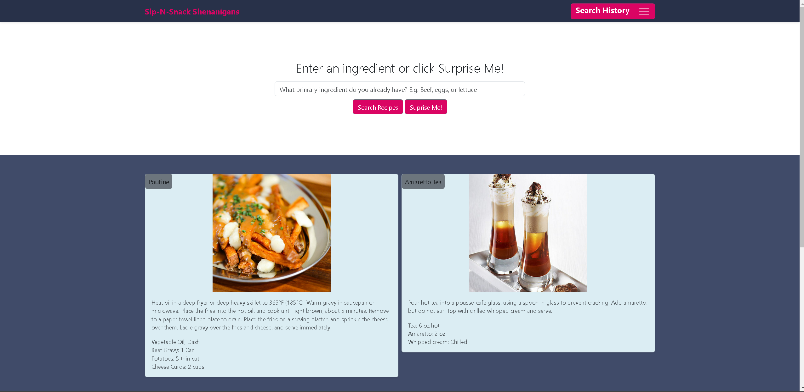

# DinnerDateGenerator

Welcome to SipNSnack Shenanigans - Your Ultimate Dinner Date Decision Solution!

About Us:
Welcome to our very first project at the Denver University Coding Bootcamp! We are team of four - Bryn Glotfelty, Maguire Wilson, Patrick Mulville, and Zachary Short - who've come together to bring you SipNSnack Shenanigans. In this collaborative effort, we've crafted an application from the ground up for our users.

🍔🍹 What We Do:
Ever find yourself stuck in the endless loop of indecisiveness when planning a date? We get it, and that's why we're here to help! Our mission is to eliminate the frustration by offering you a fun solution: random meal and drink suggestions. No need to stress about recipes, because we've got you covered - the corresponding recipe will appear beneath the enticing image and name of your chosen meal and drink.

🎁 Surprise Me!:
Not a fan of the first suggestion? No worries! Just click "Surprise Me!" until you discover the perfect combination that suits your taste buds. We believe in making date planning as enjoyable as the date itself!

🔍 Ingredient Search:
Have a specific ingredient on hand that you want to include in your culinary adventure? Simply type it into the search bar, and a meal featuring your chosen ingredient will pop up, and the search will be neatly saved in the "Saved Searches" tab at the top of your screen.

We hope SipNSnack Shenanigans adds a dash of excitement and eliminates the stress of decision-making from your date nights. Enjoy your culinary journey, and here's to many more delightful date night moments, cheers! 🥂

Link to Site: https://zachmshort.github.io/DinnerDateGenerator/

Link to GitHub Repository: https://github.com/zachmshort/DinnerDateGenerator/

Link to GitHub Repository:

